# REPORT

## Environment setup

**Email out** — I use `msmtp` with `s-nail` configured to a test mailbox.

**A backup target** — I use a second VM reachable over SSH by key. The VM is configured with `PermitRootLogin no`, `PubkeyAuthentication yes`, `PasswordAuthentication no`.

**A Git repository** https://github.com/LeNgocBao145/bash-scripting-and-ops-automation-lab.git.

---

## Task 1 — Health-check with email alerting

**From Lab 1.** Write `health-check.sh` that inspects `web01` and emails **one** alert when — and only when — something is wrong.

**Acceptance criteria**

- On a healthy host the script prints nothing and sends no email.

  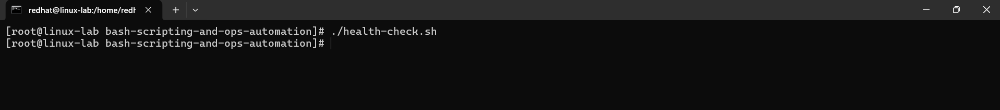

- After you **lower one threshold** (e.g. `DISK_THRESHOLD=1`) **or kill the `python3` web endpoint**, the next run sends exactly **one** email naming the host and the offending metric(s).

  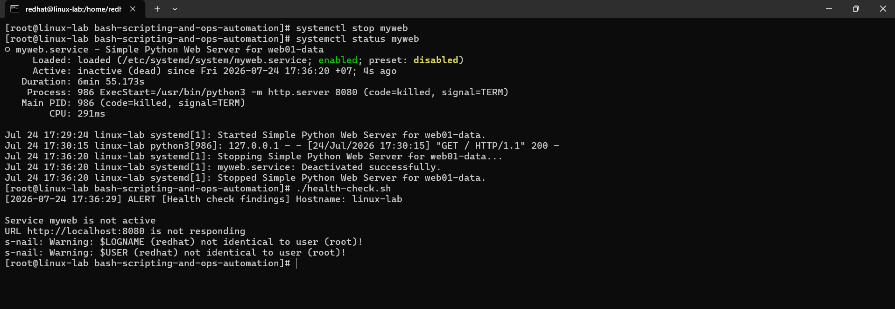


- With the endpoint stopped, the other checks still run — the email lists all current problems, not just the first.

  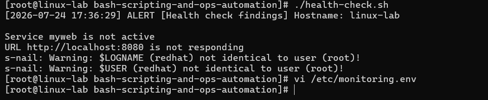

  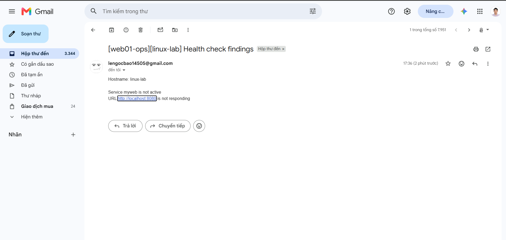
  
  As you can see the other checks like `check web-endpoint liveness` still run although the service that I monitor `myweb` which stops. And the email lists all current problems which are services and web endpoint.

---

## Task 2 — Automated backup with safe cleanup

**From Lab 2.** Write `backup.sh` that archives the data folder, ships it off the box, rotates old copies, and can never leave a half-finished backup looking valid.

**Acceptance criteria**

- Running `backup.sh` produces a dated `.tar.gz` at `$DEST`
  
  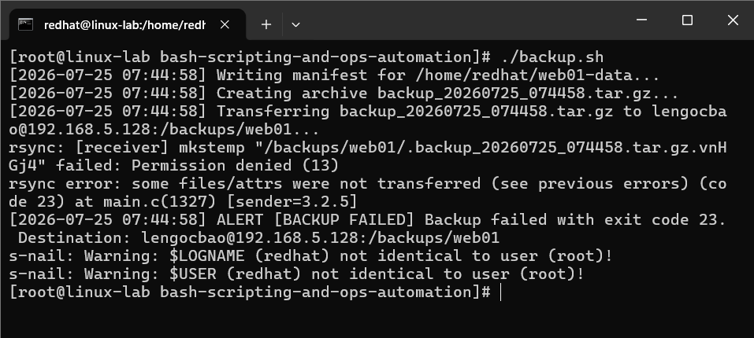

  **Caution**: When you use remote host for backups, you should ensure that the user that you use to `ssh` has permission to write or accesss to the backups folders. Here are commands that I use to add permission to user `lengocbao` for folder `/backups/web01`.

  ```bash    
  sudo chown -R lengocbao:lengocbao /backups/web01

  sudo chmod -R 755 /backups/web01
  ```

  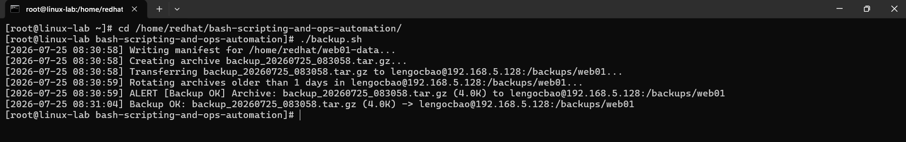

  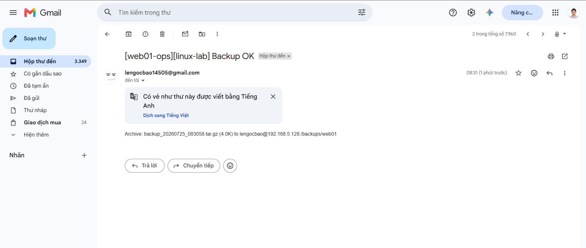

  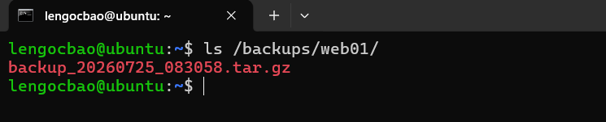

  Re-running rotates/keeps the right number of copies.

  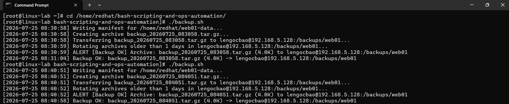

  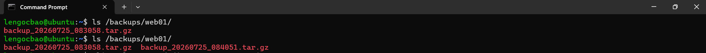

- `restore-test.sh` extracts the archive and reports **all files OK** against the manifest — capture this. A backup with no verified restore scores **zero on requirement 7**.

  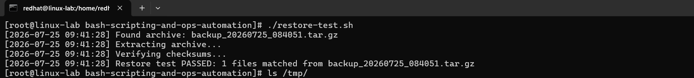  

- Simulate a failure (e.g. point `DATA_DIR` at a path that doesn't exist) and show the `trap` fired: a "BACKUP FAILED" email was sent and the temp dir was cleaned up.

  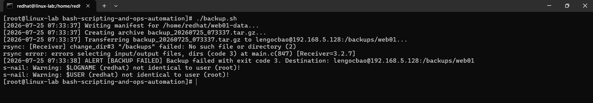  

  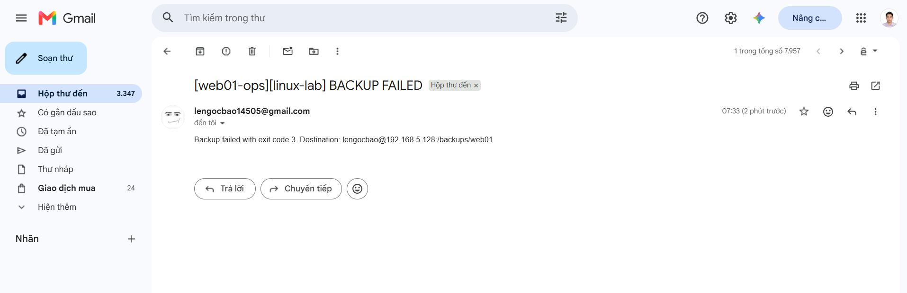

  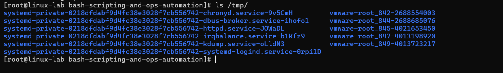

**Submit:** `backup.sh`, `restore-test.sh`, `backup.env.example`, and screenshots of a successful run, the archive listing at the destination, the restore-test manifest check, and the failure email.

---

## Task 3 — Error trapping and linting

**From Lab 3.** Make failures impossible to miss, then prove your code is clean.

**Acceptance criteria**

- The forced error stops the script at the right line and produces an alert email with line + command + exit code.

  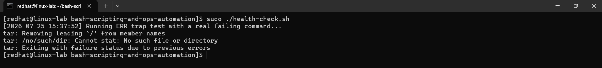  

- `shellcheck *.sh` reports **no warnings** (paste the clean output).

  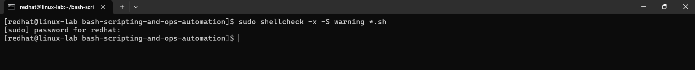  


**Submit:** the instrumented script, a screenshot of the error alert, and before/after `shellcheck` output.

---

## Task 4 — Scheduling with cron

**From Lab 4.** Make everything run itself.

**Acceptance criteria**

- `crontab -l` (or the cron.d file) shows both jobs.

  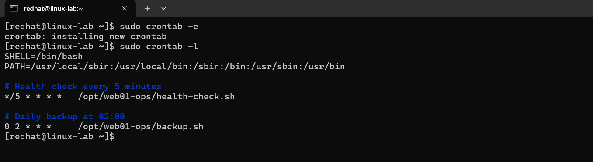  

- Logs show the health-check running on schedule; a triggered condition during that window produced a mail.

  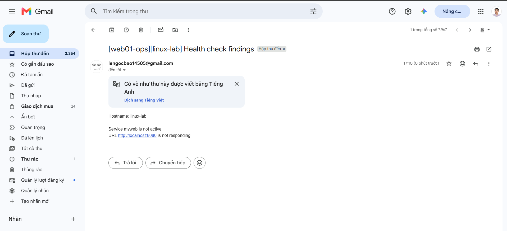  

- You can explain, in the report, why a job that works by hand can still fail under cron.

  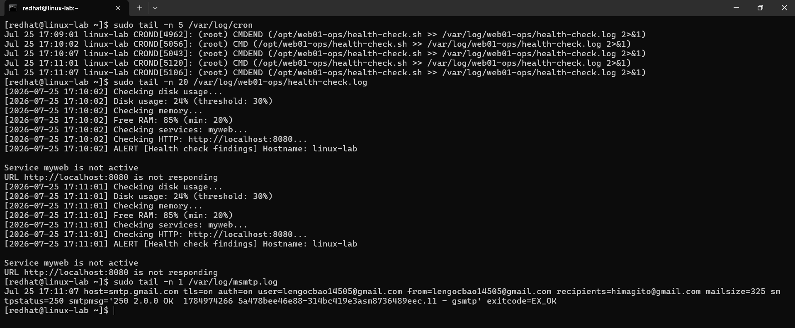  


**Submit:** your crontab / cron.d entry and a log excerpt showing scheduled runs.


## 1. Health Check

| Criterion | Script | Evidence |
|-----------|--------|----------|
| HTTP 200 check | `health-check.sh` → `check_http()` | Returns alert on non-200 |
| Disk usage alert ≥ threshold | `check_disk()` | Tested with `DISK_THRESHOLD=1` |
| CPU usage alert ≥ threshold | `check_cpu()` | Tested with `CPU_THRESHOLD=1` |
| Memory usage alert ≥ threshold | `check_mem()` | Tested with `MEM_THRESHOLD=1` |
| Alert delivery (email / Slack) | `lib/common.sh` → `send_alert()` | Log entry + mail/curl call |

## 2. Backup

| Criterion | Script | Evidence |
|-----------|--------|----------|
| Web root archived | `backup.sh` → `backup_files()` | `files.tar.gz` created |
| MySQL dump compressed | `backup_db()` | `db.sql.gz` created |
| Old backups rotated | `rotate()` | Keeps last `KEEP_DAYS` dirs |

## 3. Restore Test

| Criterion | Script | Evidence |
|-----------|--------|----------|
| Files extractable | `restore-test.sh` → `test_files()` | Extracted to temp dir |
| DB importable | `test_db()` | Imported to `*_restoretest` DB, then dropped |
| No production impact | `trap` cleanup + temp DB | Temp dir removed on exit |

## 4. Automation

| Criterion | File | Evidence |
|-----------|------|----------|
| Health check every 5 min | `cron/web01-ops.cron` | `*/5 * * * *` entry |
| Daily backup at 02:00 | `cron/web01-ops.cron` | `0 2 * * *` entry |
| Weekly restore test | `cron/web01-ops.cron` | `0 3 * * 0` entry |
