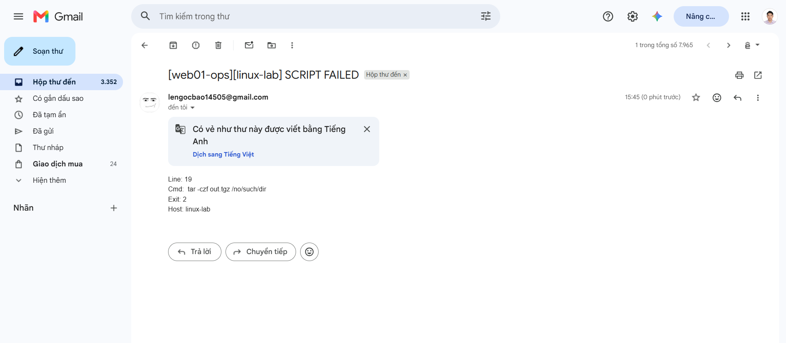
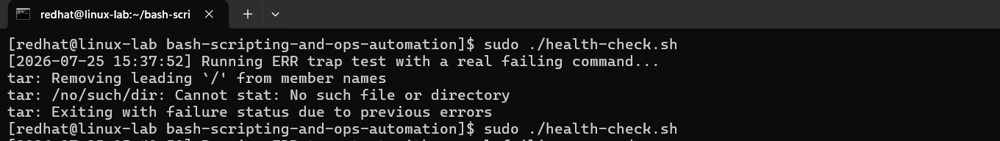

# REPORT

## Environment setup

I wrap **web endpoint** in a tiny systemd unit called myweb.

`/etc/systemd/system/myweb.service`
```bash
[Unit]
Description=Simple Python Web Server for web01-data
After=network.target

[Service]
Type=simple
User=redhat
WorkingDirectory=/home/redhat/web01-data
ExecStart=/usr/bin/python3 -m http.server 8080
Restart=always

[Install]
WantedBy=multi-user.target
```

**Email out** — I use `msmtp` with `s-nail` configured to a test mailbox.

**A backup target** — I use a second VM reachable over SSH by key. The VM is configured with `PermitRootLogin no`, `PubkeyAuthentication yes`, `PasswordAuthentication no`.

**A Git repository** https://github.com/LeNgocBao145/bash-scripting-and-ops-automation-lab.git.

---

## Task 1 — Health-check with email alerting

**From Lab 1.** Write `health-check.sh` that inspects `web01` and emails **one** alert when — and only when — something is wrong.

**Acceptance criteria**

- On a healthy host the script prints nothing and sends no email.

  
  *Caption: Health check passes with no output and no alert email.*

- After you **lower one threshold** (e.g. `DISK_THRESHOLD=1`) **or kill the `python3` web endpoint**, the next run sends exactly **one** email naming the host and the offending metric(s).

  
  *Caption: Lowering a threshold triggers exactly one alert email with host/metric details.*


- With the endpoint stopped, the other checks still run — the email lists all current problems, not just the first.

  
  *Caption: Web endpoint failure is detected during the same health-check run.*

  
  *Caption: Alert email includes multiple active problems, not only the first failure.*
  
  As you can see the other checks like `check web-endpoint liveness` still run although the service that I monitor `myweb` which stops. And the email lists all current problems which are services and web endpoint.

---

## Task 2 — Automated backup with safe cleanup

**From Lab 2.** Write `backup.sh` that archives the data folder, ships it off the box, rotates old copies, and can never leave a half-finished backup looking valid.

**Acceptance criteria**

- Running `backup.sh` produces a dated `.tar.gz` at `$DEST`
  
  
  *Caption: Running `backup.sh` creates a dated `.tar.gz` archive at `$DEST`.*

  **Caution**: When you use remote host for backups, you should ensure that the user that you use to `ssh` has permission to write or accesss to the backups folders. Here are commands that I use to add permission to user `lengocbao` for folder `/backups/web01`.

  ```bash    
  sudo chown -R lengocbao:lengocbao /backups/web01

  sudo chmod -R 755 /backups/web01
  ```

  
  *Caption: Ownership/permission setup on remote backup directory for SSH user access.*

  
  *Caption: Backup file is transferred successfully to the remote backup host.*

  
  
  *Caption: Remote destination shows uploaded backup artifacts as expected.*

  Re-running rotates/keeps the right number of copies.

  
  *Caption: Re-running backup rotates old copies according to retention rules.*

  
  *Caption: Only the configured number of recent backup files is kept.*

- `restore-test.sh` extracts the archive and reports **all files OK** against the manifest — capture this. A backup with no verified restore scores **zero on requirement 7**.

    
  *Caption: `restore-test.sh` validates extracted files against the manifest (all files OK).*

- Simulate a failure (e.g. point `DATA_DIR` at a path that doesn't exist) and show the `trap` fired: a "BACKUP FAILED" email was sent and the temp dir was cleaned up.

    
  *Caption: Failure is intentionally triggered by using an invalid `DATA_DIR`.*

  
  *Caption: The `trap` handler sends a "BACKUP FAILED" email on error.*

  
  *Caption: Temporary working directory is cleaned up after backup failure.*

---

## Task 3 — Error trapping and linting

**From Lab 3.** Make failures impossible to miss, then prove your code is clean.

**Acceptance criteria**

- The forced error stops the script at the right line and produces an alert email with line + command + exit code.

    
  *Caption: Forced error stops script at the expected failing command.*

    
  *Caption: Alert email includes line number, command, and exit code.*

  **Note**: By default, Bash shell options `set -e` and `trap '...' ERR` **do not inherit the `ERR` trap inside shell functions**. If a command fails within a function, the script may terminate immediately without executing the custom error handler (`on_error`), leading to unhandled crashes and missing log context. 

  
  *Caption: Demonstrates why `set -E` is needed for `ERR` trap inheritance in functions.*

  **Solution:** Enable the **`-E`** flag (or `set -o errtrace`) at the beginning of the script:
  ```bash
  set -euo pipefail
  set -E  # Equivalent to: set -eEuo pipefail

  Because I use these commands to force error stops the script

  ```bash
  run_error_trap_test() {
    if [[ "${ENABLE_TRAP_TEST:-0}" == "1" ]]; then
      tar -czf out.tgz /no/such/dir
      log "Running ERR trap test with a real failing command..."
      log "UNREACHABLE: this line must not run"
    fi
  }
  ```

- `shellcheck *.sh` reports **no warnings** (paste the clean output).

     
  *Caption: `shellcheck` reports no warnings for all shell scripts.*

  ```bash
  [redhat@linux-lab bash-scripting-and-ops-automation]$ sudo shellcheck -x -S warning *.sh
  [sudo] password for redhat:
  [redhat@linux-lab bash-scripting-and-ops-automation]$
  ```
  
---

## Task 4 — Scheduling with cron

**From Lab 4.** Make everything run itself.

**Acceptance criteria**

- `crontab -l` (or the cron.d file) shows both jobs.

  
  *Caption: Crontab contains both scheduled jobs.*

- Logs show the health-check running on schedule; a triggered condition during that window produced a mail.

  
  *Caption: Logs confirm the health-check runs automatically on schedule.*

  
  *Caption: A triggered condition during cron window results in email notification.*

- You can explain, in the report, why a job that works by hand can still fail under cron.

  A command that works in an interactive shell can fail in cron because cron runs in a **different, minimal, non-interactive environment**.

  **Common causes and fixes**

  1. **Minimal `PATH`**
     - **Issue:** Cron often uses only `/usr/bin:/bin`.
     - **Impact:** `command not found` for tools in custom paths.
     - **Fix:** Set `PATH` explicitly or use absolute binary paths.

     ```bash
     PATH=/usr/local/sbin:/usr/local/bin:/usr/sbin:/usr/bin:/sbin:/bin
     ```

  2. **Missing environment variables**
     - **Issue:** Variables from `~/.bashrc`, `~/.bash_profile`, or app `.env` are not loaded.
     - **Impact:** App/config initialization fails.
     - **Fix:** Source required env files inside the script.

     ```bash
     #!/usr/bin/env bash
     source /etc/environment
     # or:
     source /opt/app/.env
     ```

  3. **Different working directory**
     - **Issue:** Cron usually starts from the user's home, not the project folder.
     - **Impact:** Relative paths break.
     - **Fix:** `cd` to a known directory or use absolute paths.

     ```bash
     #!/usr/bin/env bash
     cd "$(dirname "$0")" || exit 1
     ```

  4. **Permission/user mismatch**
     - **Issue:** Manual runs may use `sudo`, cron may run as a normal user.
     - **Impact:** `Permission denied` on files/services.
     - **Fix:** Install cron for the correct user (or root) and set proper ownership/permissions.

  5. **Shell mismatch (`sh` vs `bash`)**
     - **Issue:** Cron may run with `/bin/sh`, while script uses Bash features.
     - **Impact:** Syntax errors from Bash-specific code.
     - **Fix:** Use a Bash shebang and/or set shell in crontab.

     ```bash
     SHELL=/bin/bash
     ```

  6. **No TTY / non-interactive execution**
     - **Issue:** Cron has no terminal for prompts.
     - **Impact:** Jobs hang/fail when commands ask for input.
     - **Fix:** Use non-interactive flags and avoid prompt-based commands.

  7. **Stdout/stderr mail handling**
     - **Issue:** Cron mails command output; MTA/msmtp config may be incomplete.
     - **Impact:** Mail delivery errors can hide real problems.
     - **Fix:** Redirect logs explicitly and set `MAILTO` correctly (or disable).

     ```bash
     MAILTO=""
     # or MAILTO="user@example.com"
     ```

  8. **Invalid log redirection path**
     - **Issue:** Cron applies `>> /path/file.log 2>&1` before script starts.
     - **Impact:** Job fails immediately if directory does not exist.
     - **Fix:** Pre-create log directories and verify write permissions.